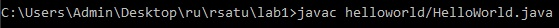
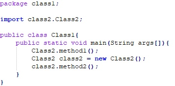
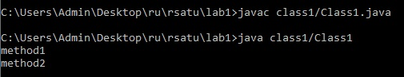
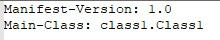
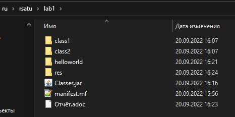

= Отчет по лабораторной работе №1

Группа ИВМ-22

Павлов И. М., Тимофеев А. А.

== 1. Задачи

В процессе выполнения лабораторной работы необходимо выполнить следующие задачи:

1. Создать исполняемый java класс, который выводит текстовую строку на экран
2. Разработать два класса. Первый класс вызывает 2 метода из второго класса (статический и нестатический)
3. Создать jar-файл, хранящий элементы из предыдущего задания

== 2. Ход работы

Java класс, который выводит текстовую строку на экран, выглядит следующим образом:

Для создания и исполнения данного класса сначала необходимо скомпилировать исходный файл:

Полученный java класс уже можно запустить с помощью следующей операции:

Для выполнения 2 задачи необходимо создать 2 класса, первый из которых вызывает 2 метода второго класса (статический и нестатический).

Первый класс представлен на рисунке ниже:

Второй класс выглядит следующим образом:

Первый класс сначала вызывает статический метод второго класса без создания его экземпляра.
Затем, чтобы вызвать нестатический метод, создается объект class2, из которого можно вызвать второй метод.

Для компиляции и запуска написанной программы были использованы команды:

В 3 задаче необходимо создать jar-файл, хранящий элементы из предыдущего задания.
Для того, чтобы создать jar-файл, сначала нужно создать файл manifest.mf, в котором будет указан главный исполняемый класс.
Файл manifest.mf представлен на скриншоте ниже:

Далее выполняем команды по сборке архива и запуска созданного файла:

Итоговый каталог выглядит следующим образом:

== 3. Вывод

В ходе выполнения лабораторной работы были изучены базовые принципы работы java,
созданы и скомпилированы несколько классов, создан общий jar-файл.