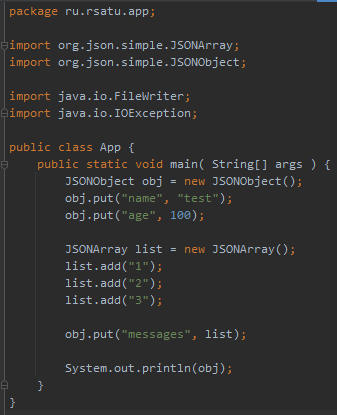
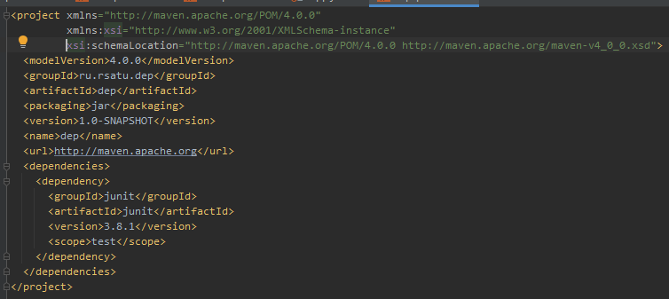

= Отчет по лабораторной работе №2

Группа ИВМ-22

Павлов И. М., Тимофеев А. А.

== 1. Задачи

В процессе выполнения лабораторной работы необходимо выполнить следующие задачи:

1. Создать несколько maven-проектов:

    1.1 Родительский
    1.2 2 Дочерних (1 дочерний проект зависит от второго)

2. Подключить внешнюю зависимость (из глобального репозитория) в один из проектов и продемонстрировать работу этой зависимости.

3. Создать maven-проект, который будет помещен в локальный репозиторий. Добавить этот проект как зависимость в проект из п.1

4. Создать maven-проект, упаковать его в jar-with-dependencies, продемонстрировать рабту jar. Запустить проект с помощью maven.

5. Выполнить тест подключенной зависимости из п.2 с помощью junit

== 2. Ход работы

Для выполнения первого задания были созданы родительский проект m1 и два дочерних проекта ch1 и ch2, где ch2 зависит от ch1.
Они представлены на скриншотах ниже.

m1 pom.xml:

ch1 pom.xml:

ch2 pom.xml:

Для выполнения второго задания добавим в дочерний проект ch2 библиотеку json-simple

Класс App

Для запуска и выполнения класса была использована следующая команда:

----
mvn compile exec:java -Dexec.mainClass="ru.rsatu.app.App" -e
----

Результат выполнения:
----
{"name":"test","messages":["1","2","3"],"age":100}
----

Для выполнения третьего задания был создан проект dep, содержащий класс Dep

dep pom.xml:

Код класса Dep:

Этот проект был собран и добавлен в локальный репозиторий следующей командой:

----
mvn install
----

После этого проект dep был добавлен в зависимости к проекту ch2

Для выполнения четвертого задания добавляем в проект ch2 слудующую структуру:

Для сборки и запуска были использованы следующие команды:

----
mvn clean
mvn package assembly:single
mvn exec:java
----

Результаты выполнения:
----
{"name":"test","messages":["1","2","3"],"age":100}
----

Для выполнения пятого задания добавим в проект ch2 библиотеку junit.

Далее был создан класс GoTest в котором находились тестируемые функции:

А так же был создан класс GoTestTest, содержащий тесты

Затем было проведено успешное тестирование с помощью команды
----
mvn test
----

== 3. Вывод

В результате выполнения лабораторной работы получены навыки по работе с maven, созданию вложенных проектов с зависимостями, их тестирование и сборка в jar-with-dependencies, а так же размещение проектов в локальном репозитории.
