= Отчет по лабораторной работе №3

Группа ИВМ-22

Павлов И. М., Тимофеев А. А.

== 1. Задачи

В процессе выполнения лабораторной работы необходимо выполнить следующие задачи:

1. ООП.

    1.1 Создать интегрфейс
    1.2 Создать абстрактный класс
    1.3 Создать класс, имплементирующий интерфейс
    1.4 Создать класс-наследник абстрактного класса

2. Reflection

    2.1 Выгрузить все поля и методы класса с помощью рефлексии
    2.2 Вызвать несколько методов класса
    2.3 Вывести на экран всех предков класса

3. Collections

    3.1 Ознакомится со всеми коллекциями java (list, set, map) и их реализацией
    3.2 Продемонстрировать в программе работу с каждым видом реализации коллекции (list, set, map)

4. Generics

    4.1 Сделать дженерик на класс
    4.2 Сделать дженерик на метод

== 2. Ход работы

Элементы для первого задания будут находиться в пакете oop. Создадим интерфейс с методом:

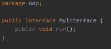

Создадим абстрактный класс с методом:

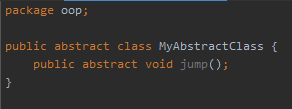

Класс, имплементирующий интерфейс, будет содержать реализацию метода. Он будет выглядеть следующим образом:

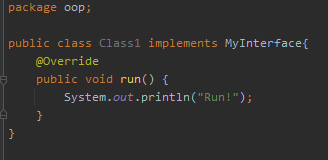

Второй класс-наследник абстрактного класса также будет иметь ревализацию метода. Он представлен ниже:

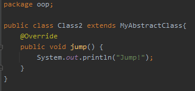

Итак, в ходе выполнения первого задания были созданы два класса, один из которых реализует интерфейс, а второй наследует абстрактный класс.

Элементы второго задания будут находиться в пакете reflection.

Класс, элементы которого мы будем отображать с помощью рефлексии, будет иметь 4 поля, 3 метода,
а также наследоваться от второго класса из предыдущего задания. Он представлен ниже:

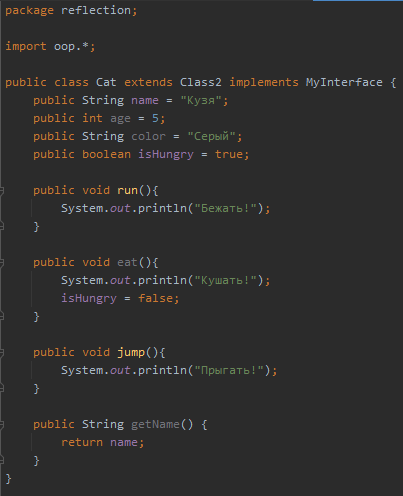

Для выполнения задания создадим класс ReflectionClass. Первый метод будет выгружать все поля и методы класса с помощью рефлексии:

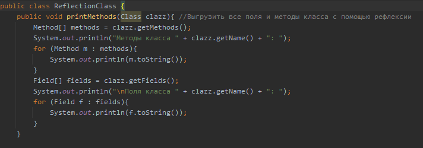

Второй метод вызывает несколько методом класса:

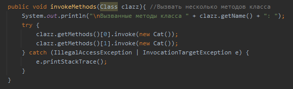

Третий метод будет выводить на экран список всех предков:

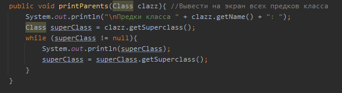

Запустим программу из класса Main. Результаты работы представлены ниже:

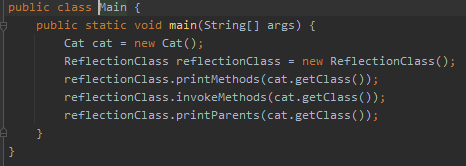

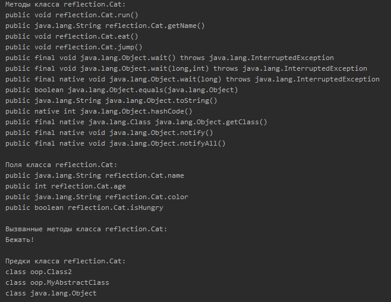

Элементы третьего задания будут находиться в пакете collections.

Для работы с коллекциями создадим класс CollectionsClass. Создадим 3 разных коллекции: List, Map и Set,
а также методы для работы с ними:

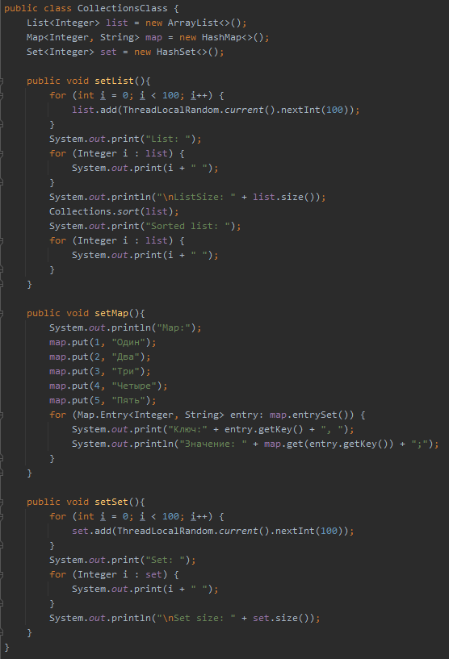

Были выполнены заполнения коллекций случайными числами и вывод на экран, а также сортировка list.
Запустим программу из класса Main. Результаты работы представлены ниже:

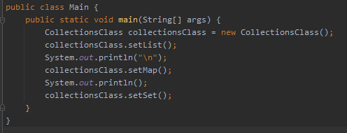

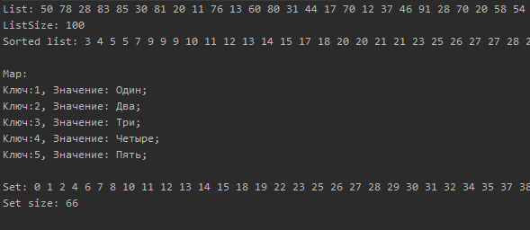

Элементы четвертого задания будут находиться в пакете generics.

Создадим обобщенный класс, и внутри него обобщенный метод. Он будет выводить список тех элементов,
которыми будет вызван:

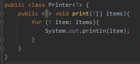

Запустим программу из класса Main. Результаты работы представлены ниже:

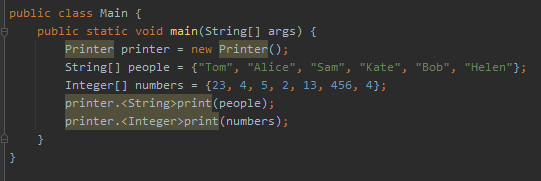

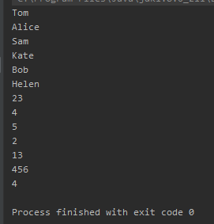

== 3. Вывод

В ходе выполнения лабораторной работы были изучены следующие темы:
Объектно-ориентированное программирование, Reflection, Коллекции и Generics,
были выполнены все задания по ним.