= Отчет по лабораторной работе №4

Группа ИВМ-22

Павлов И. М., Тимофеев А. А.

== 1. Задачи

В процессе выполнения лабораторной работы необходимо выполнить следующие задачи:

1. ClassLoader

    1.1 Ознакомится с руководством по загрузке классов и ClassLoader
    1.2 Продемонстрировать работу своего загрузчика классов
    1.3 Определить разницу между своей и стандартной реализацией

2. JDBC

    2.1 Установить соединение с БД с помощью JDBC драйвера
    2.2 Создать таблицу БД с помощью JDBC
    2.3 Реализовать CRUD-методы для одной таблицы
    2.4 Реализовать несколько запросов в БД, которые должны выполняться в рамках одной транзакции

3. Exception

    3.1 Обернуть методы для работы с БД в try/catch с откатом транзакций и закрытием соединения
    3.2 Продемонстрировать в программе откат транзакции

== 2. Ход работы

Элементы для первого задания будут находиться в пакете classloader. Создадим интерфейс с методом:

Собственно созданный загрузчик классов должен иметь метод нахождения класса,
в котором будет происходить вызов метода загрузки данных этого класса.
Класс загружается в виде массива байтов.
Реализация своего загрузчика классов будет выглядеть следующим образом:

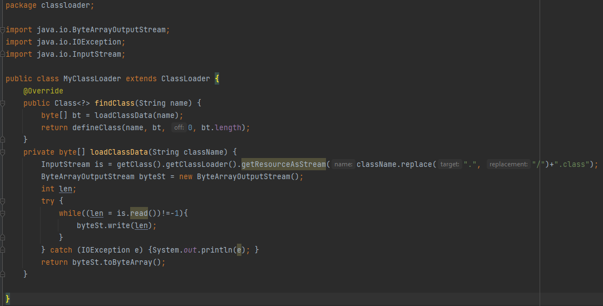

Загружаемый класс выводит сообщение об успешной загрузке. Он представлен ниже:

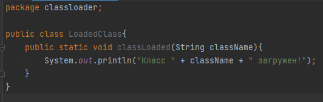

В классе Main создается объект загрузчика классов, загружается информация об искомом классе,
создается его объект и из него вызывается метод.

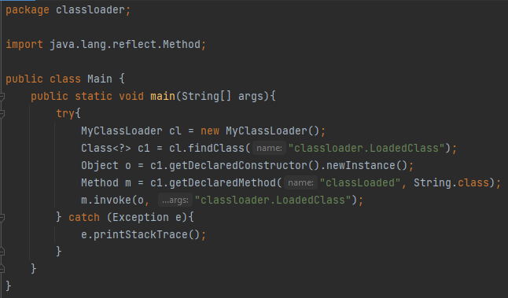

Таким образом, загрузчик классов Java по умолчанию может загружать только классы из локальной файловой системы,
что достаточно хорошо для большинства случаев. Но, если нам необходимо загрузить классы из интернета,
то можно расширить существующий загрузчик классов.

Элементы второго и третьего задания будут находиться в пакете db.

Для выполнения данного задания была использована объектно-реляционная система управления базами данных PostgreSQL.
Установка и подключение к базе данных осуществлялось с помощью JDBC драйвера.
Создадим класс для управления созданной БД. Сперва необходимо установить соединение с БД.
Для этого необходимо ввести URl, имя пользователя и пароль
Метод подключения представлен ниже:

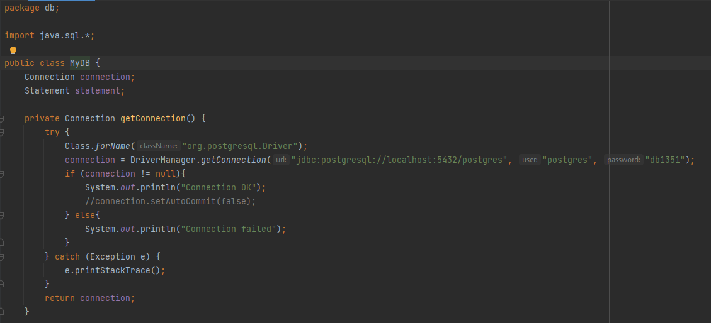

Далее необходимо создать новую таблицу. Создадим метод createTable. Таблица будет иметь поля id, name и age.

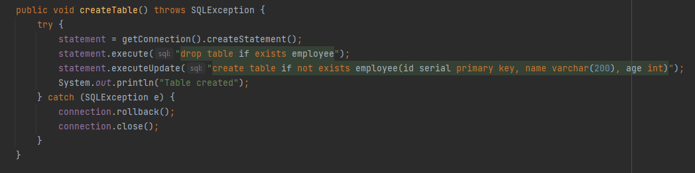

Реализуем несколько CRUD-методов для одной таблицы и создадим несколько запросов в БД в рамках одной транзакции.

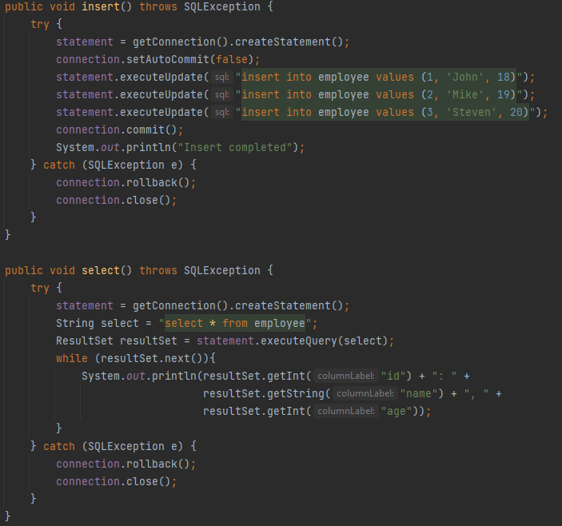

В методе insert проведем транзакцию, в которой сформируем 3 запроса на добавление записей в существующую таблицу.

Метод select будет выводить все существующие записи таблицы в консоль.

Результат проведения всех вышеперечисленых операций выводится на экран в классе Main:

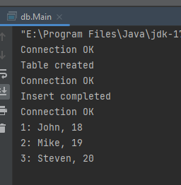

Созданную таблицу со всеми созданными полями можно увидеть через встроенный плагин Database,
а также открыть саму таблицу.

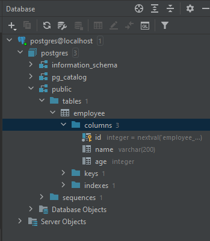

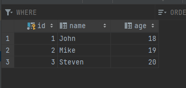

Для выполнения третьего задания необходимо обернуть все методы для работы с БД в try/catch с откатом транзакций и закрытием соединения,
что было сделано выше.
Продемонстрируем в программе откат транзакции.
Для примера, если новом объекте для таблицы ввести больше параметром, чем требуется,
то произойдет откат произведенной транзакции:

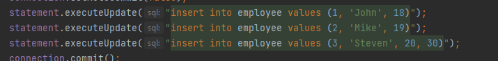

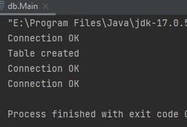

Для этого также было необходимо установить параметр AutoCommit у нашего соединения как false.

== 3. Вывод

В ходе выполнения лабораторной работы были изучены следующие темы:
ClassLoader, JDBC, были выполнены все задания.