= Отчет по лабораторной работе №5

Группа ИВМ-22

Павлов И. М., Тимофеев А. А.

== 1. Задачи

В процессе выполнения лабораторной работы необходимо выполнить следующие задачи:

. Метод добавления автора
. Вывод всех книг по ид автора
. Удаление книги
. Удаление автора

== 2. Ход работы

Для выполнения первого задания созданы следующие классы:

----
1) Author - сущность Автор;
2) AuthorDTO - DTO для Author;
3) AuthorMapper - Mapper для преобразования Author и AuthorDTO;
4) AuthorRepository - Репозиторий, обращающийся к базе данных для Author;
5) AuthorResource - Ресурс для взаимодействия с Author по http;
6) AuthorService - Сервис для взаимодействия с AuthorMapper, AuthorsRepository и AuthorResource.
----

Author:

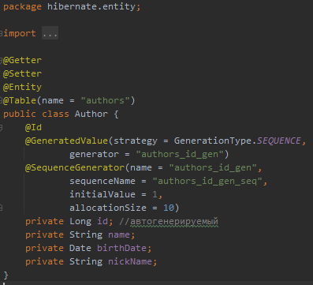

AuthorDto:

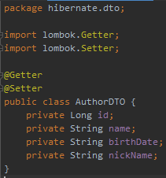

AuthorMapper:

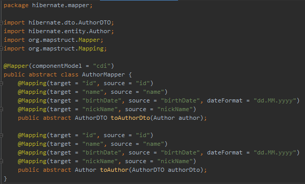

AuthorsRepository:

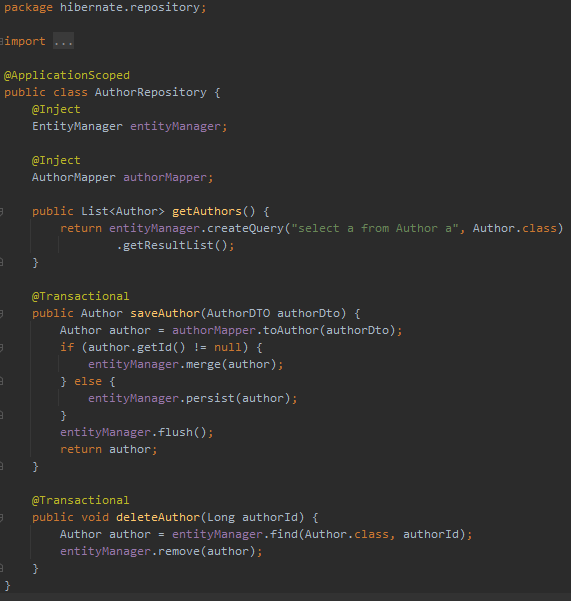

AuthorsService:

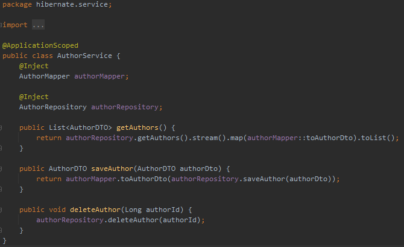

AuthorResource:

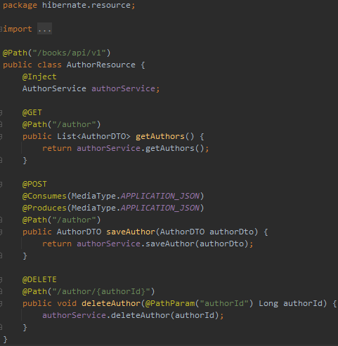

Для выполнения второго задания создадим аналогичные классы из первого задания для сущности Книга:

----
1) Book;
2) BookDTO;
3) BookMapper;
4) BookRepository;
5) BookResource;
6) BookService.
----

Далее модифицируем класс BookResource и добавим метод для получения книг по автору.

BookResource:

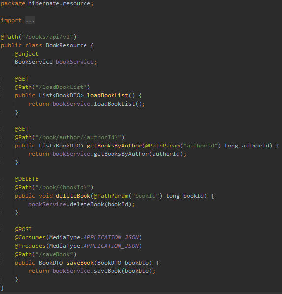

Для работы этого метода добавим методы getBooksByAuthor в классы BooksRepository и BookService:

BookRepository:

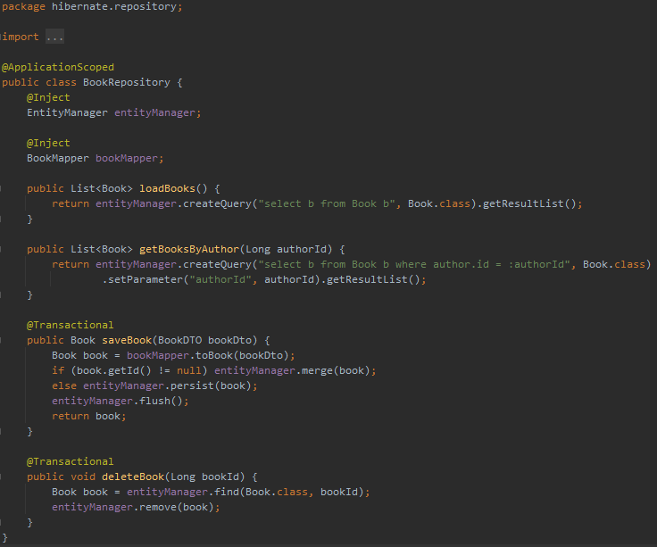

BooksService:

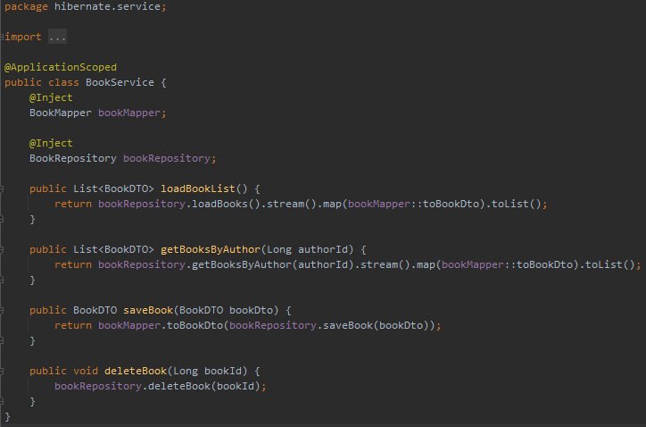

Для реализации третьего задания и возможности удалять книги добавим необходимые методы в следующие классы:

BooksRepository:

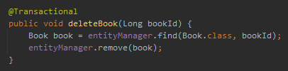

BooksService:

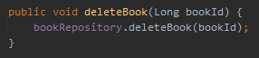

BookResource:

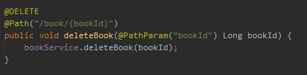

Для реализации четвертого задания необходимо добавить метод в Book:

Book:

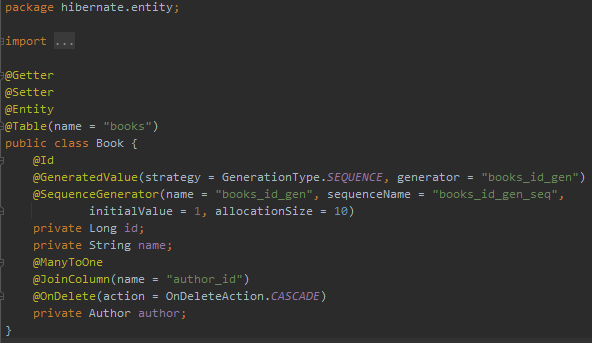

Так же потребуется добавить метод в AuthorResource и необходимые для его работы методы в AuthorsService и AuthorsRepository.
Скриншоты данных модификаций были представлены ранее.

Результаты тестирования всех операций были выполнены успешно.
== 3. Вывод

В результате выполнения лабораторной работы получены навыки по работе с библиотекой hibernate в процессе создания backend-части сервера.